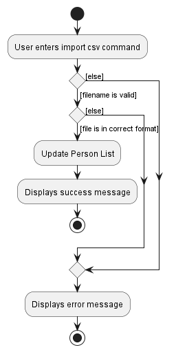

### Overview
BookFace is an NUS-centered contacts management system that allows students of NUS to organise their list of friends and acquaintances that they have met in their various classes, CCAs, project groups etc. The application aims to provide NUS students a means to keep track of the contact details of the numerous people they have met during their time in NUS in hopes of facilitating better communication among peers, as well as provide a centralised channel for students to obtain relevant administrative contact information of the various departments and faculties that are in the school.

### Summary of Contributions

Given below are my contributions to the project.

**Code contributed**: [RepoSense link](https://nus-cs2103-ay2223s2.github.io/tp-dashboard/?search=&sort=groupTitle&sortWithin=title&timeframe=commit&mergegroup=&groupSelect=groupByRepos&breakdown=true&checkedFileTypes=docs~functional-code~test-code~other&since=2023-02-17&tabOpen=true&tabType=authorship&tabAuthor=pkpaing&tabRepo=AY2223S2-CS2103-F11-4%2Ftp%5Bmaster%5D&authorshipIsMergeGroup=false&authorshipFileTypes=docs~functional-code~test-code&authorshipIsBinaryFileTypeChecked=false&authorshipIsIgnoredFilesChecked=false)

**Features implemented**

* **New Feature**: `import`
* What it does: Import staff contacts for relevant faculties. 'staff' can refer to any person in the teaching, administrative or management teams in the faculty.
* Justification: As the target audience for the application is NUS students, it would be of great help if they were able to import the default contacts for their respective faculties, to help them get familiar with these contacts.

**Contributions to the UG**

The following are the list of sections that have been contributed to the UG:

- Command Summary
- Features
  - Exit the program: `exit` 
  - Quick Import for faculty contacts: `import`

**Contributions to the DG**

The following are the list of sections that have been contributed to the DG:

- Architecture
- Use Cases
- Planned Enhancements
  - Enhancement 3 - Filling import feature with real data
  - Enhancement 4 - Having more options for faculties for import feature
- Implementation
  - Import feature

**Contributions to team-based tasks**

The following are the list of team-based tasks accomplished:
- Maintaining the issue tracker
- Adding non-feature related sections to the UG and DG

**Review/mentoring contributions**

Main contributions in this aspect revolve around reviewing and approving of teammate's Pull Requests, as well as sharing technical opinions through informal channels, such as team meetings and group chat with team members.

**Contributions beyond the project team**

Participated in the Practical Exam Dry Run and performed bug testing on the [E-Lister](https://github.com/AY2223S2-CS2103T-T17-3/tp) application.

### Contributions to the Developer Guide (Extracts)

The diagrams contributed to the DG are reproduced below.

    
    
<i>Figure 1: Import sequence diagram</i>

    
    
<i>Figure 2: Import Activity diagram</i>

