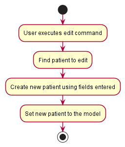

## Overview
BookFace is a NUS-centered contact management application that allows students to keep track of details of people they 
have met in the campus, for example in situations such as having the same CCAs, same classes. It can even be adding 
people due to the simplest reason by labeling them as 'acquaintance' or 'classmate'. It is intended to act as a digital 
means of storing contacts to help NUS students organize their university contacts in one place such that they can easily 
look it up whenever they want. In addition, the application also comes with import point of contacts with the professors
which are categorized based on the school that the users are in.

## Summary of Contributions

### Code Contributed

[Here](https://nus-cs2103-ay2223s2.github.io/tp-dashboard/?search=&sort=groupTitle&sortWithin=title&timeframe=commit&mergegroup=&groupSelect=groupByRepos&breakdown=true&checkedFileTypes=docs~functional-code~test-code~other&since=2023-02-17&tabOpen=true&tabType=authorship&tabAuthor=SHni99&tabRepo=AY2223S2-CS2103-F11-4%2Ftp%5Bmaster%5D&authorshipIsMergeGroup=false&authorshipFileTypes=docs~functional-code~test-code~other&authorshipIsBinaryFileTypeChecked=false&authorshipIsIgnoredFilesChecked=false)
is a link to view the code that has been contributed to the team project.
The section below will provide a brief overview on what key features have
been implemented.

### Enhancement Implemented

Main contributions that I have enhanced involve two key features:

**Feature enhancement**: `Add command`
* What it does: The original `add` function in AB3 takes in 5 fields, namely (name, phone, email, address, tags). The 
current version has an additional _compulsory_ field, named **status** and a few enhancement to differentiate tags 
according to their types (general, commitment, module). The tags will remain as optional input, while the rest of the 
fields are necessary, else there is exception.
* Justification: The `status` is added as an important field there is a strong emphasis on the year and course that 
the students are in. Meanwhile, three tag types were included, each has their own attributes (colour-coded labeling, 
custom strings) to split tags up based on the following tag commands (t\, mt\, ct\) that users enter. It also acts to 
enhance the overall user experience by having a user interface.
* Highlights: One of the concerns is that the input fields have been restrained down to their respective word limits as 
the frame cannot accommodate to _very long_ texts.

**Feature enhancement**: `Edit command`
* What it does: The original `edit` function in AB3 allows users to effectively change the contents of the fields 
without deleting the existing contact and creating a new one. The editing of tags is available in current implementation
of **Bookface**, with the inclusion of commitment and module tags on top of the original tag (now general tag).
* Justification: The improvement is made to cater to users the flexibility to modify tags based on its type. When users 
change a tag type, the existing tags in the type will be replaced with the new ones. The other type will remain 
unaffected. The prefix inputs follow AB3, which will work even if it is entered in any order.
* Highlights: The challenge is to understand the code first then trace to build on top of the existing structure.

### Contributions to UG

The following are the list of sections that have been contributed to the UG:

- Wrote the following sections of the BookFace [User Guide](https://ay2223s2-cs2103-f11-4.github.io/tp/UserGuide.html):
  - Add user contacts: `add`
  - Edit user contacts: `edit`

### Contributions to DG

Wrote the following sections of the BookFace [Developer Guide](https://ay2223s2-cs2103-f11-4.github.io/tp/DeveloperGuide.html):
- Enhancement:
  - Add Feature
  - Edit Feature (to be implemented by today)

### Contributions to team-based tasks

The following are the list of team-based tasks accomplished:
- Setting up Codecov in project landing page on Github
- Create and issue-ing of issues on several milestones

### Review/mentoring contributions:
Reviewing and approving of teammate's Pull Requests, also commenting on member's
pull requests about the code quality to maintain. Lastly, actively participated in 
team meetings to sharing my opinions. And actively communicate and instantly respond
to any new pull requests and questions asked by team members.

### Contributions beyond the project team:
- Design user interface and the general appearance of Bookface (interactive widget, additional details pane, style)
- Participated in the Practical Exam Dry Run and performed bug testing on
the [wheregottime](https://github.com/AY2223S2-CS2103T-T09-2/tp) application.
- Provided aid for peer that is facing with the same issue in forum 
[Issue #302](https://github.com/nus-cs2103-AY2223S2/forum/issues/302).
- Clarified doubts with Github forum actively to resolve issues along the way 
[Issue #107](https://github.com/nus-cs2103-AY2223S2/forum/issues/107#issuecomment-1410144214).

### Contributions to the Developer Guide (Extracts)
Some diagrams that contributed to the Developer Guide

    
    
<i>Figure 1: Add sequence diagram</i>

    
    
<i>Figure 2: Add activity diagram</i>

    
    
<i>Figure 3: Edit sequence diagram</i>

    
    
<i>Figure 4: Edit activity diagram</i>

