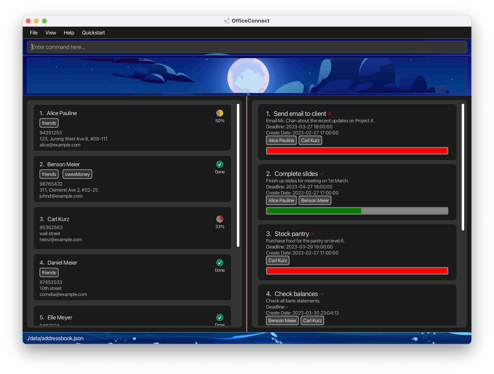

### Project: OfficeConnect

OfficeConnect is a task management tool for managerial personnel, addressing challenges like work overload, task coordination, and time-consuming manual tasks.

Contributions to the project:

* **Feature Enhancement**: Light and Dark Theme

    

        
        
Light Theme

    

    

        
        
Dark Theme

    

  * What it does: Toggle between light and dark themes using F2 and F3 keyboard shortcuts.
  * Justification: Enhances user experience, reduces eye strain, and offers personalization.
  * Highlights: Quick theme switching and improved usability in different lighting conditions.

 

* **Feature Enhancement**: Local Storage
  * What it does: Save and restore OfficeConnect data to a local file.
  * Justification: Convenient, reliable data storage and access, improves productivity.
  * Highlights: Streamlined data management and user control over their data.

 
 

---

* **New Feature**: View Assigned and Unassigned Elements
  * What it does: Filter and view assigned and unassigned persons, tasks, and persons to tasks in the address book.
  * Justification: Enhances usability and helps manage assignments more efficiently.
  * Highlights: Flexible filtering and focus on relevant elements.

 

* **New Feature**: Unassign People from Tasks
  * What it does: Remove people from specific tasks, updating their assignment status.
  * Justification: Allows users to manage assignments more efficiently.
  * Highlights: Easy removal of people from tasks and better assignment management.

 

- **Code contributed**: [RepoSense link](https://nus-cs2103-ay2223s2.github.io/tp-dashboard/?search=spwwj&sort=groupTitle&sortWithin=title&timeframe=commit&mergegroup=&groupSelect=groupByRepos&breakdown=true&checkedFileTypes=docs~functional-code~test-code~other&since=2023-02-17)

* **Project management**:
  * Release [v1.2](https://github.com/AY2223S2-CS2103-F10-1/tp/releases/tag/v1.2)
  * On time on all tasks

* **Documentation**:
  * User Guide:
    * Added documentation for the features unassign, view assign task/person, view unassign task/person,
  * Developer Guide:
    * Added implementation for storage
    * Update Model diagram
    * Added implementation details unassign, view assign task/person, view unassign task/person

* **Community**:
  * PRs reviewed (with non-trivial review comments): [#40](https://github.com/AY2223S2-CS2103-F10-1/tp/pull/40#discussion_r1118711937), [#51](https://github.com/AY2223S2-CS2103-F10-1/tp/pull/51#discussion_r1121492505), [#75](https://github.com/AY2223S2-CS2103-F10-1/tp/pull/75#discussion_r1133074183), [#79](https://github.com/AY2223S2-CS2103-F10-1/tp/pull/79#discussion_r1133245018), [#81](https://github.com/AY2223S2-CS2103-F10-1/tp/pull/81#discussion_r1135499427), [#94](https://github.com/AY2223S2-CS2103-F10-1/tp/pull/94#discussion_r1138820272), [#111](https://github.com/AY2223S2-CS2103-F10-1/tp/pull/111#discussion_r1141284228), [#118](https://github.com/AY2223S2-CS2103-F10-1/tp/pull/118#discussion_r1146141362), [#112](https://github.com/AY2223S2-CS2103-F10-1/tp/pull/122#discussion_r1146349228)
  * Contributed to forum discussions: [#11](https://github.com/nus-cs2103-AY2223S2/forum/issues/11#issuecomment-1384992448), [#47](https://github.com/nus-cs2103-AY2223S2/forum/issues/47#issuecomment-1399987282), [#104](https://github.com/nus-cs2103-AY2223S2/forum/issues/104#issuecomment-1409941102), [#107](https://github.com/nus-cs2103-AY2223S2/forum/issues/107#issuecomme), [#122](https://github.com/nus-cs2103-AY2223S2/forum/issues/122#issuecomment-1412319186), [#146](https://github.com/nus-cs2103-AY2223S2/forum/issues/146#issuecomment-1422189929), [#151](https://github.com/nus-cs2103-AY2223S2/forum/issues/151#issuecomment-1425169865), [#152](https://github.com/nus-cs2103-AY2223S2/forum/issues/152#issuecomment-1424141503), [#153](https://github.com/nus-cs2103-AY2223S2/forum/issues/153#issuecomment-1423804206), [#158](https://github.com/nus-cs2103-AY2223S2/forum/issues/158#issuecomment-1425415869), [#161](https://github.com/nus-cs2103-AY2223S2/forum/issues/161#issuecomment-1427034867), [#169](https://github.com/nus-cs2103-AY2223S2/forum/issues/169#issuecomment-1426995367)

