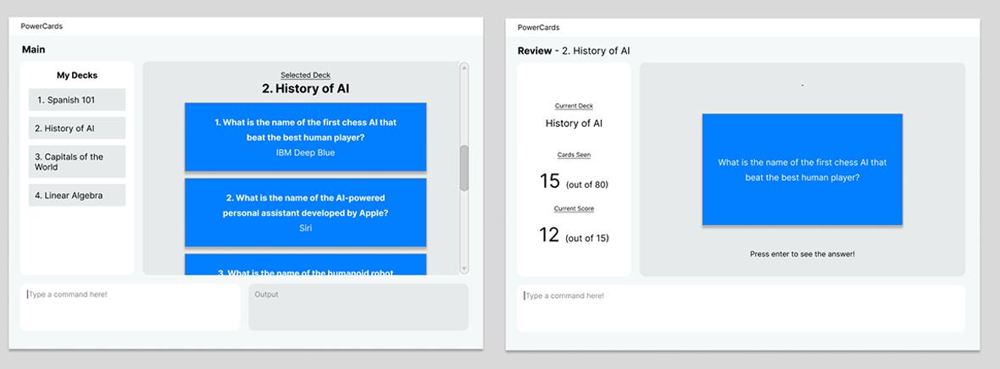

### Project: PowerCards

PowerCards enable university students to input a pool of information (question-answer pairs) of their desired topic and utilize the application to practice active recall of this information.

Given below are my contributions to the project.

* **New Feature**: Design and implement styling of the overall UI on Figma - Main and Review mode screens and PowerCards Logo (PR [#162](https://github.com/AY2223S2-CS2103T-W11-3/tp/pull/162) [#181](https://github.com/AY2223S2-CS2103T-W11-3/tp/pull/181) [#183](https://github.com/AY2223S2-CS2103T-W11-3/tp/pull/183) [#187](https://github.com/AY2223S2-CS2103T-W11-3/tp/pull/187))

*Initial prototype design of PowerCards UI.*

  * What it does: Allows users to navigate the app intuitively and enjoy the user experience.
  * Justification: The UI of a flashcard application is a key component of usability and attractiveness of the product.
  * Highlights: The user flows of first creating decks then cards were considered in the creation of the 2 panel (one for deck, one for cards) interface. 

  * **New Feature**: Review Mode and the related commands - Start/End Review, Flip, Next, Previous, and Tag Difficulty (PRs [#73](https://github.com/AY2223S2-CS2103T-W11-3/tp/pull/73) [#99](https://github.com/AY2223S2-CS2103T-W11-3/tp/pull/99) [#128](https://github.com/AY2223S2-CS2103T-W11-3/tp/pull/128) [#147](https://github.com/AY2223S2-CS2103T-W11-3/tp/pull/147) [#162](https://github.com/AY2223S2-CS2103T-W11-3/tp/pull/162) [#178](https://github.com/AY2223S2-CS2103T-W11-3/tp/pull/178) [#179](https://github.com/AY2223S2-CS2103T-W11-3/tp/pull/179) [#181](https://github.com/AY2223S2-CS2103T-W11-3/tp/pull/181) [#183](https://github.com/AY2223S2-CS2103T-W11-3/tp/pull/183) [#231](https://github.com/AY2223S2-CS2103T-W11-3/tp/pull/231) [#236](https://github.com/AY2223S2-CS2103T-W11-3/tp/pull/236)
      * What it does: Allows users to review the all cards in a deck or optionally review cards by the difficulty tagged.
      * Justification: It enables users to test their knowledge on the decks which is a vital purpose of PowerCards
      * Highlights: The user experience of the CLI was a great priority - hence the keys for the commands were selected to be all in close proximity to each other and the 'Enter' key, enabling users to do fast, one-handed operations in the review mode.
    
  * **Code contributed**: [RepoSense link](https://nus-cs2103-ay2223s2.github.io/tp-dashboard/?search=11-3&sort=groupTitle&sortWithin=title&timeframe=commit&mergegroup=&groupSelect=groupByRepos&breakdown=true&checkedFileTypes=docs~functional-code~test-code~other&since=2023-02-17&tabOpen=true&tabType=authorship&zFR=false&tabAuthor=unfazing&tabRepo=AY2223S2-CS2103T-W11-3%2Ftp%5Bmaster%5D&authorshipIsMergeGroup=false&authorshipFileTypes=docs~functional-code~test-code&authorshipIsBinaryFileTypeChecked=false&authorshipIsIgnoredFilesChecked=false)

  * **Project management**:
      * Responded to PRs promptly and with earnest feedback
      * Checked in with teammates consistently though the project

  * **Documentation**:
      * User Guide:
          * Contributed to the Review Mode, Main Mode (after Deck selected), and Command Summary sections of the UG (PR [#242](https://github.com/AY2223S2-CS2103T-W11-3/tp/pull/242))
      * Developer Guide:
          * Contributed to the Review Mode Implementation details [#351](https://github.com/AY2223S2-CS2103T-W11-3/tp/pull/351) [#356](https://github.com/AY2223S2-CS2103T-W11-3/tp/pull/356)
          * Added Planned Enhancement section (PR: [#311](https://github.com/AY2223S2-CS2103T-W11-3/tp/pull/311))

  * **Community**:
      * PRs reviewed within the group: [#89](https://github.com/AY2223S2-CS2103T-W11-3/tp/pull/89) [#98](https://github.com/AY2223S2-CS2103T-W11-3/tp/pull/98) [#156](https://github.com/AY2223S2-CS2103T-W11-3/tp/pull/156) [#167](https://github.com/AY2223S2-CS2103T-W11-3/tp/pull/167) [#189](https://github.com/AY2223S2-CS2103T-W11-3/tp/pull/186)
