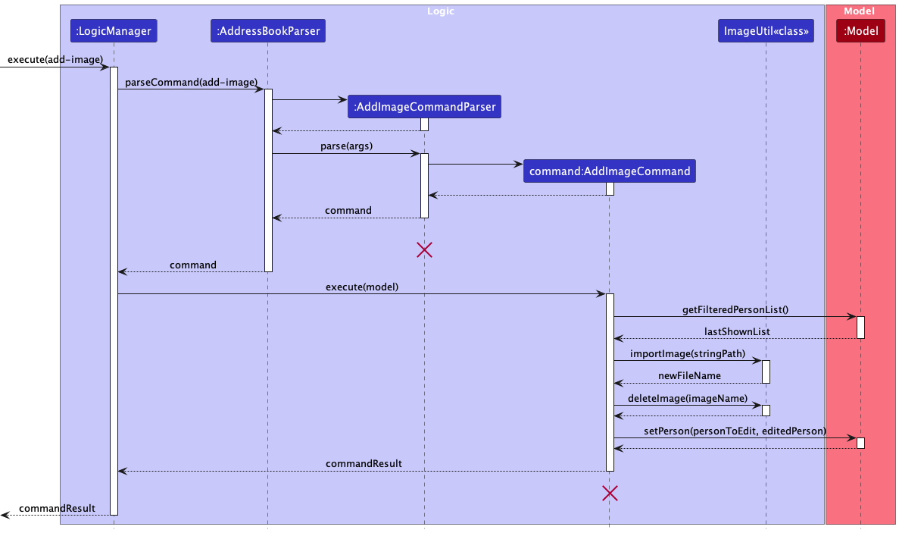
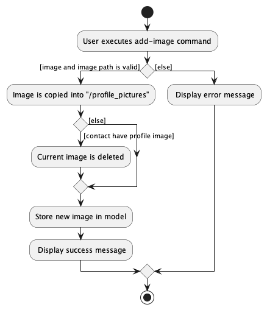

#### Overview
BookFace is a National University of Singapore (NUS)-centered address book application. 
It is intended to help members of the university organize their related university contacts. With enhanced contact organization, we hope to encourage and maintain connections amongst students, 
staff and other members of the university. As university is a place where one can meet many people, we have included functionalities to help find and identify different contacts.
BookFace also has a contact import feature to help newer or exchange students to better navigate the university. 

#### Summary of Contributions

**Code Contributed**
* **Code contributed**: [RepoSense link](https://nus-cs2103-ay2223s2.github.io/tp-dashboard/?search=weekiat-douze&breakdown=true)

**Enhancement Implemented**
* Add Image to contact
  * What it does: Enables user to specify an image file to be used as a contact profile picture
  * Justification: Having an image with the contact helps user to better identify their contacts.
  * Highlight: This feature is more complex as it takes in a file rather than just text. 
    There are many ways that a file can be invalid: invalid path, invalid file format, permissions, etc.
    After ensuring that the provided file is valid, we also need to copy the file so that any changes 
    to the original file will not break the application. To copy the file, we also need to ensure that 
    our destination directory exist in case there is tampering. 
   To prevent storage leak, we also have to ensure images that are to be replaced are deleted. 

* Image Retrieval
  * What it does: Retrieve saved image to be displayed as a contact's profile picture.
  * Justification: Enable GUI to display the profile picture. 
  * Highlight: As `addressbook.json` and `profile_pictures/` are visible to the user, we have to ensure that during each retrieval,
    the image and is valid. Faced an issue where retrieval did not work as the way JavaFX references file is different.
    We were only able to access files relative to the `resources` directory. Fortunately, I have discovered a fix that allows
    us to access both `profile_pictures/`, where the user images are stored, and `resources` directory, where the default image is stored. 

* `ImageUtil` class
  * What it does: A collection of Image-related operations used in `add-image`, `delete-image` and image retrieval
  * Justification: Improve code reuse across different features.
  * Highlight:
    * `importImage` does the necessary image and directory checks before making a copy of the image
    * `deleteImage` deletes the referenced image, after consideration I decided that this method returns a boolean which
      indicates whether deletion actually occurred rather than throwing an error. This is to avoid the application breaking 
      due to tampering with stored images.
    * `isValidImage` does necessary checks before indicating whether a file is ready to be retrieved and used as profile picture
    * `checkDirectory` ensures that the `profile_pictures/` directory is available before executing any operations

**Contributions to User Guide**

* Wrote the following sections of the BookFace [User Guide](https://ay2223s2-cs2103-f11-4.github.io/tp/UserGuide.html):
  * Add an image for contacts (`add-image` function)
  * Quick Import for admin contacts (`import` function)

**Contributions to Developer Guide**

* Wrote the following sections of the BookFace [Developer Guide](https://ay2223s2-cs2103-f11-4.github.io/tp/DeveloperGuide.html):
  * Add Image Feature
  * Planned Enhancement

**Contributions to team-based tasks**
* Translated tasks into Issues and assigned them on the GitHub repository.
* Ensure that the deadline for milestones are valid
* Setup Google Docs for Team collaboration on User Guide. 
* Setup postmortem in project notes document
* Setup PE-D triaging in project notes document 

**Review/mentoring contributions**
* Reviewed teammate's pull requests, reported bugs in teammate's features as well as provided fixes in some cases.
* Examples: 
  * Detected incorrect examples used in UG
  * Lack of data persistence in import feature
  * Find tags worked incorrectly in certain cases (provided fix)
  
**Contributions beyond project team**

* Provided insight on a peer's problem in the course forum [#161](https://github.com/nus-cs2103-AY2223S2/forum/issues/161)
* PE-D Bug Testing for [CookHub](https://github.com/AY2223S2-CS2103T-W09-1/tp) application

**Contribution to Developer Guide (Extracts)**

Some diagram contributions to the Developer Guide:

    
    
<i>Figure 1: Add Image sequence diagram</i>

    
    
<i>Figure 2: Add Image activity diagram</i>

